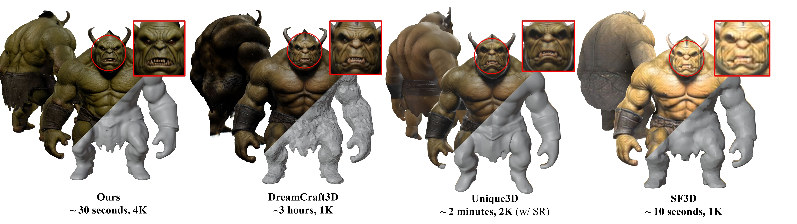
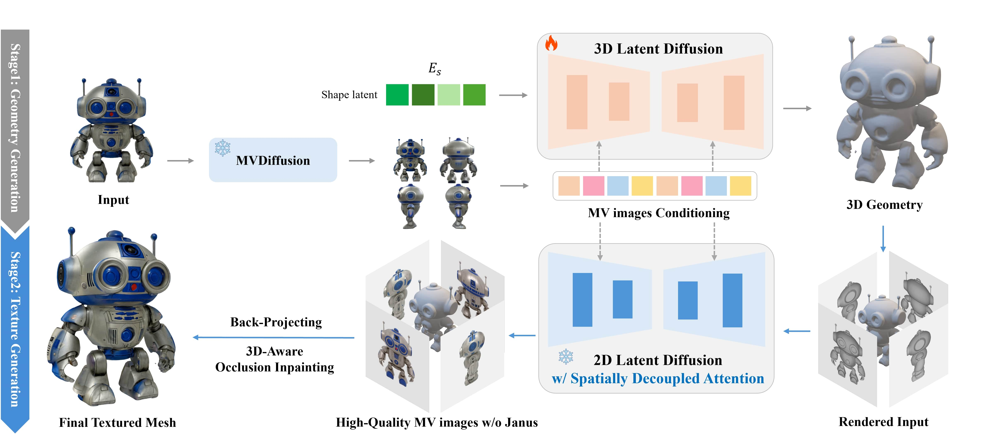

# CaPa-Carve-n-Paint-Synthesis-for-Efficient-4K-Textured-Mesh-Generation
<a href="https://hwan-h-heo.github.io/hwan-h-heo.io/">Hwan Heo</a>, 
<a href="https://scholar.google.com/citations?user=wXah-2MAAAAJ">Jangyeong Kim</a>, 
<a href="https://www.linkedin.com/in/seongyeong-lee-b99914183?utm_source=share&utm_campaign=share_via&utm_content=profile&utm_medium=ios_app">Seongyeong Lee</a>, 
Jeong A Wi,
Junyoung Choi,
Sangjun Ahn*

 
 &nbsp;

Official Repository of **CaPa**: Carve-n-Paint Synthesis for Efficient 4K Textured Mesh Generation

#### TL; DR: we propose CaPa, a novel method for generating hyper-quality 4K textured mesh under only 30 seconds, providing 3D assets ready for commercial applications such as games, movies, and VR/AR.

## Overview

## Results

- The results video appears lower quality due to GIF conversion. Please visit the <a href='https://ncsoft.github.io/CaPa'>project page</a> to explore the high-quality, interactive 4K textured mesh.

## Licenses

© 2024 NCSOFT Corporation. All Rights Reserved.
