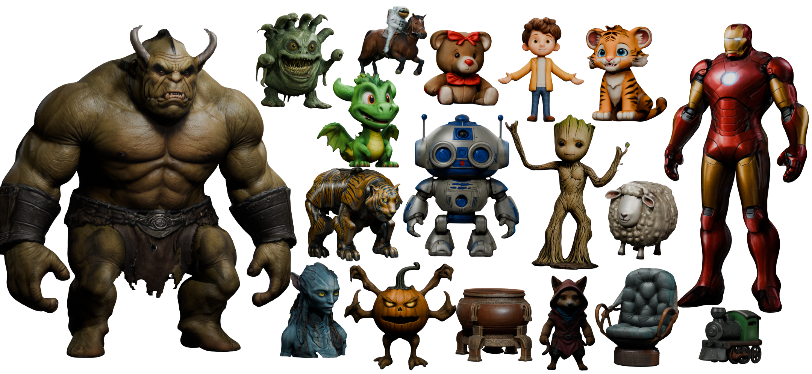

# CaPa-Carve-n-Paint-Synthesis-for-Efficient-4K-Textured-Mesh-Generation
<a href="https://hwan-h-heo.github.io/hwan-h-heo.io/">Hwan Heo</a>, 
<a href="https://scholar.google.com/citations?user=wXah-2MAAAAJ">Jangyeong Kim</a>, 
<a href="https://www.linkedin.com/in/seongyeong-lee-b99914183?utm_source=share&utm_campaign=share_via&utm_content=profile&utm_medium=ios_app">Seongyeong Lee</a>, 
Jeong A Wi,
Junyoung Choi,
Sangjun Ahn*

<a href='https://ncsoft.github.io/CaPa'></a> 
<a href='https://arxiv.org/abs/2501.09433'></a> &nbsp;


Official Repository of **CaPa**: Carve-n-Paint Synthesis for Efficient 4K Textured Mesh Generation



#### TL; DR: we propose CaPa, a novel method for generating hyper-quality 4K textured mesh under only 30 seconds, providing 3D assets ready for commercial applications such as games, movies, and VR/AR.

<!--  -->


## Overview


## Results

- The results video appears lower quality due to GIF conversion. Please visit the <a href='https://ncsoft.github.io/CaPa'>project page</a> to explore the high-quality, interactive 4K textured mesh.

## Citation

```bibtex
@article{heo2025capa,
    title = {CaPa: Carve-n-Paint Synthesis for Efficient 4K Textured Mesh Generation}, 
    author = {Hwan Heo and Jangyeong Kim and Seongyeong Lee and Jeong A Wi and Junyoung Choi and Sangjun Ahn},
    journal = {arXiv preprint arXiv:2501.09433},
    year = {2025},
}
```

## Related Project
- <a href='https://ncsoft.github.io/ncresearch/3f0ba4889e331ddbed68c9dd48d845fa18d874de'>***Texture Copilot*** </a> service in NCSOFT

[](https://www.youtube.com/embed/HvyPxxDzrwo?si=fvLPdWsv613WCRTu)

## Licenses

© 2024 NCSOFT Corporation. All Rights Reserved.
